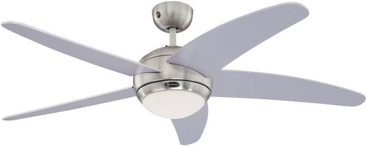
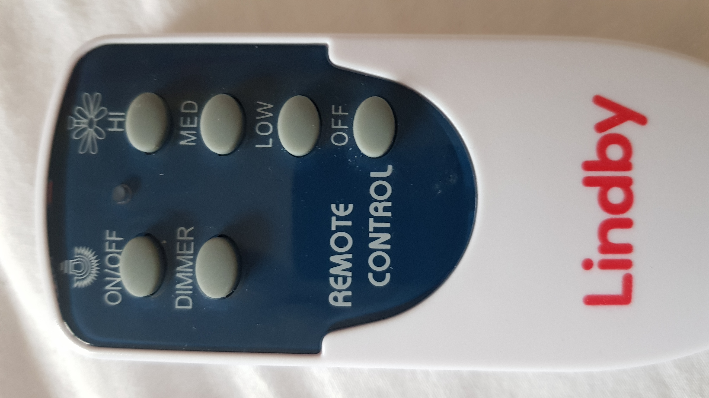

# ESP8266IRFancontroller-Lyndby

link: <https://github.com/MichielfromNL/ESP8266IRFancontroller>

## Description

This is a project that used an ESP8266 to control a Lyndby ceilingfan.
It turns out the IR protocol is the same as my IR ceilingfan.

## Remote

Unknown

## Button mapping

From the project page:

* On/Off = 0xC08
* Dimmer = 0xC20
* High = 0xC01
* Medium = 0xC04
* Low = 0xC43
* Off = 0xC10

Mapped to key numbers

* K1 = HI = Fan high speed
* K3 = MED = Fan medium speed
* K4 = ON/OFF = Light On/Off
* K5 = OFF = Fan Off
* K6 = DIMMER = Light dimmer
* K7 = LOW = Fan low speed

## IR captures

Capture was done using [IRremoteESP8266](https://github.com/crankyoldgit/IRremoteESP8266)

```text
Protocol  : SYMPHONY
Codes     :  (12 bits)
uint16_t rawData[95] = {
1254, 432,  1254, 432,  408, 1276,  408, 1256,  428, 1276,  410, 1276,  408, 1276,  408, 1278,  408, 1278,  406, 1276,  410, 1276,  408,
7940,  1254, 432,  1254, 432,  408, 1276,  408, 1276,  408, 1278,  1252, 434,  1254, 432,  1254, 430,  1254, 432,  1254, 434,  1252, 432,  1252, 
7096,  1254, 432,  1254, 432,  408, 1278,  408, 1276,  408, 1276,  410, 1256,  428, 1276,  408, 1276,  1254, 432,  410, 1274,  408, 1276,  408, 
7940,  1254, 434,  1252, 432,  408, 1276,  410, 1276,  408, 1278,  408, 1278,  408, 1276,  408, 1278,  1252, 434,  406, 1276,  408, 1276,  408};  // SYMPHONY C00
```

## Photos

These are photos of fan and the remote.

 
