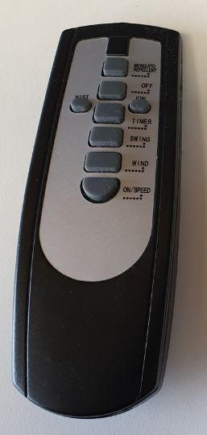
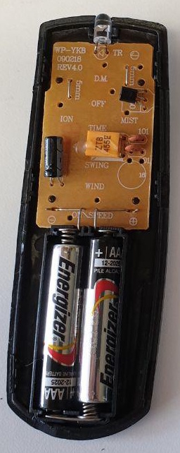
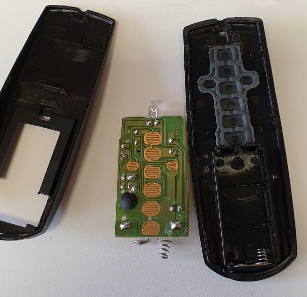
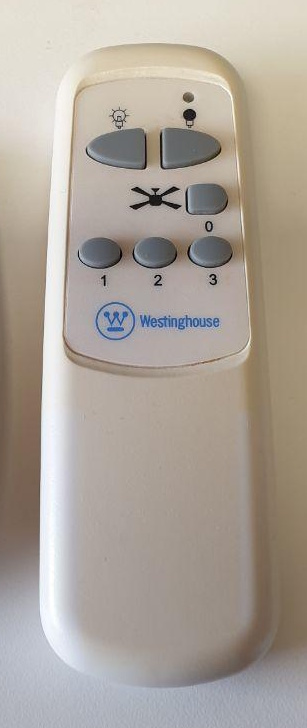
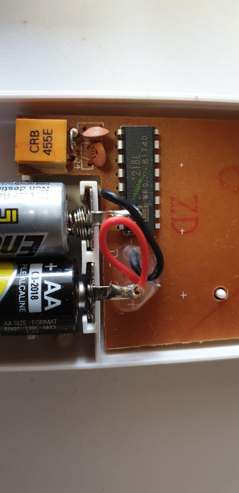
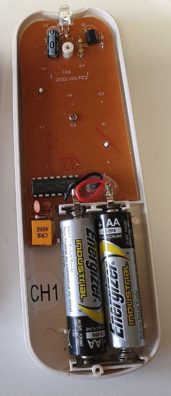

# 1105 - add support for SM5021 IR chip

link: <https://github.com/crankyoldgit/IRremoteESP8266/issues/1105>

## Description

This issue requests to add support for SM5021 IR chip.
It seems similar to the protocol my IR ceilingfan uses, just without the preambles it seems.

This document extracts the most relevant parts.

This is the link to the datasheet of the [SM5021 IR chip](https://pdf1.alldatasheet.com/datasheet-pdf/view/124369/ANALOGICTECH/SM5021B.html)

## Supported products

Brand: Blyss, Model: Owen-SW-5 3 speed Fan with water mist (has photos)
Brand: Blyss, Model: WP-YK8 090218 Owen-SW-5 3 speed Fan with water mist remote
Brand: Westinghouse, Model: Unknown Ceiling fan with lights
Brand: Westinghouse, Model: 78095 Ceiling Fan Remote
Brand: Satellite electronic, Model ID6 Ceiling Fan Remote

## Remote

The issue mentions 2 remotes. These are very different from what I have seen until now (the white ones with blue/green faceplate and 6 or 8 buttons)

## Button mapping

Unknown

## IR captures

Note that the earlier captures in the issue seem to be invalid. A comment mentions a mismatch in frequency.

The last one seems fine.

```text
Library : v2.7.6

Protocol : SYMPHONY
Code : 0xC20 (12 Bits)
uint16_t rawData[191] = {1326, 398, 1296, 398, 448, 1246, 448, 1246, 448, 1246, 448, 1220, 1322, 400, 446, 1246, 448, 1246, 448, 1246, 448, 1246, 450, 8002, 1320, 400, 1294, 426, 418, 1250, 444, 1250, 444, 1252, 442, 1254, 1290, 430, 414, 1254, 440, 1254, 440, 1254, 440, 1278, 416, 8034, 1290, 430, 1266, 430, 416, 1252, 442, 1252, 442, 1252, 442, 1252, 1290, 406, 440, 1254, 440, 1254, 440, 1256, 438, 1256, 440, 8036, 1290, 406, 1288, 430, 416, 1278, 416, 1280, 416, 1278, 416, 1278, 1266, 430, 416, 1278, 416, 1278, 416, 1278, 416, 1280, 414, 8062, 1264, 430, 1266, 430, 414, 1278, 416, 1280, 416, 1254, 440, 1252, 442, 1254, 442, 1252, 442, 1252, 442, 1252, 442, 1254, 440, 8034, 1290, 406, 1290, 404, 440, 1254, 442, 1252, 442, 1252, 442, 1254, 442, 1252, 442, 1254, 440, 1254, 442, 1252, 442, 1254, 442, 8034, 1290, 406, 1290, 404, 440, 1254, 442, 1254, 442, 1254, 440, 1252, 442, 1254, 442, 1252, 442, 1254, 440, 1254, 442, 1252, 442, 8036, 1288, 406, 1288, 406, 440, 1254, 440, 1254, 440, 1254, 442, 1254, 442, 1254, 440, 1254, 440, 1254, 442, 1254, 440, 1254, 440}; // SYMPHONY C20
uint64_t data = 0xC20;
```

## Photos

### Blyss Owen-SW-5

   

### Westinghouse

It is not mentioned which model of the 2 it is.

   
