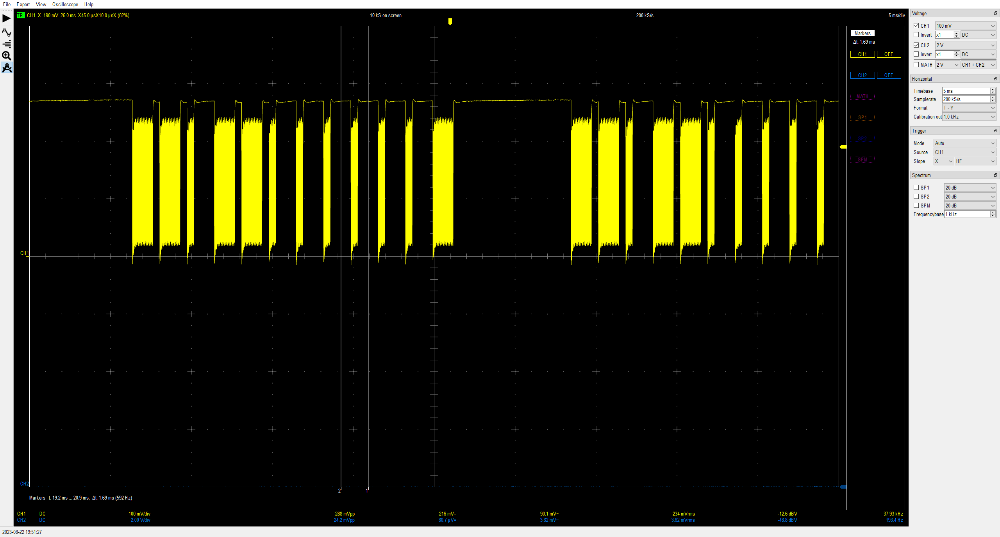
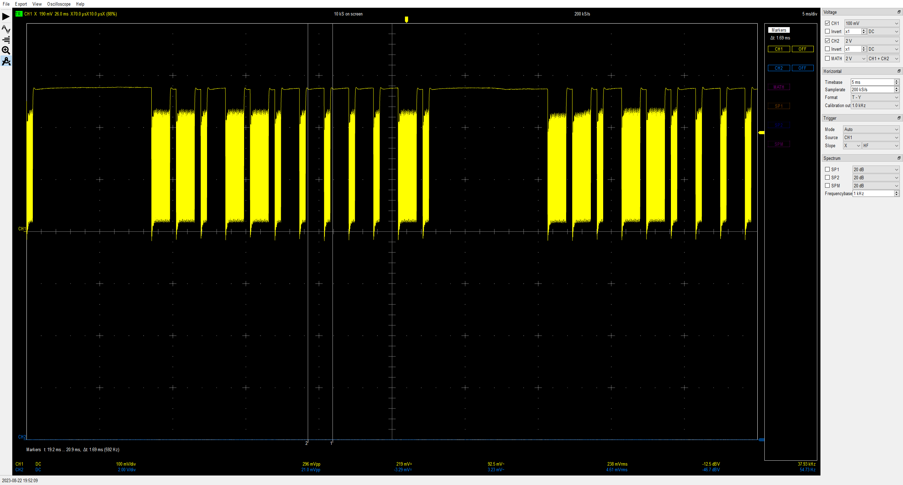
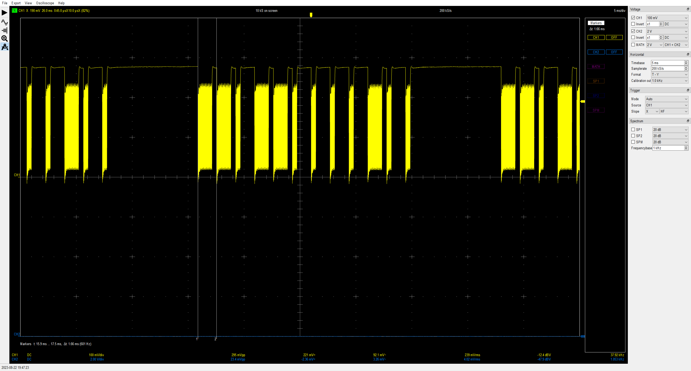
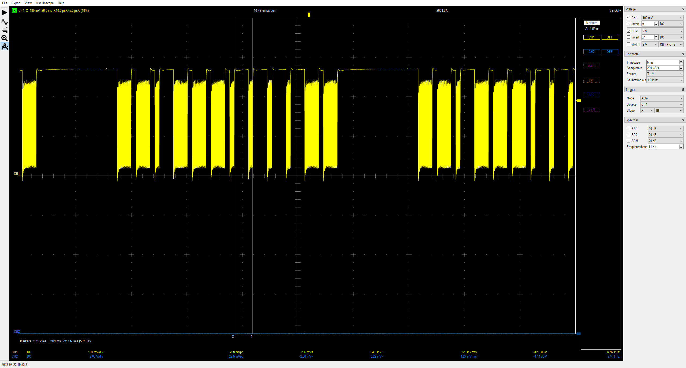
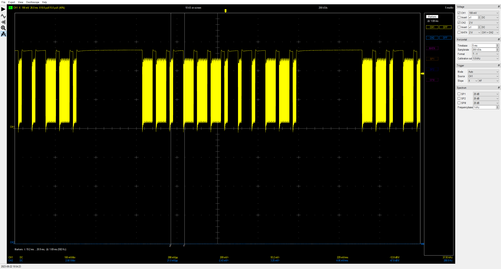

# Vornado TRANSOM window fan with IR remote

reddit link: <https://www.reddit.com/r/arduino/comments/xtyoq2/unknown_ir_protocol/>
most relevant comment: <https://www.reddit.com/r/arduino/comments/xtyoq2/comment/jxdbodi/>

## Description

The Reddit thread is trying to figure out the IR codes for Vornado TRANSOM window fan with IR remote. It is mentioned that it is using an MT911-8 chip from Meixiwei, but [the datasheet link](https://www.meixiwei.com/en/infrared-remote-control-chip/) is dead and I can't find alternatives.
At some point there is someone that responds with the codes that were found/captured. These were 12 bit, so good chance it is Symphony related.

There is also a link to a repo with some analysis and an Arduino sketch, but nothing new it seems.
Github repo: <https://github.com/elementcarbon12/vornado_transom_remote_test>

This document extracts the most relevant parts.

## Supported products

Brand: Vornado
Product: Transom

## Button mapping

| Button              | Code  |    |
| ------------------- | ----- | -- |
| airflow direction   | 0xD81 | K1 |
| down arrow          | 0xD82 | K2 |
| power button        | 0xD84 | K3 |
| temperature control | 0xDC3 | K7 |
| up arrow            | 0xDC6 | K8 |

## Protocol insights

Note that this remote does not use the standard custom code 00.

Custom code = 11

## Signal captures

Scope image captures linked from the thread <https://imgur.com/a/waveform-captures-from-vornado-transom-window-fan-remote-control-fAsYjgp>

    
