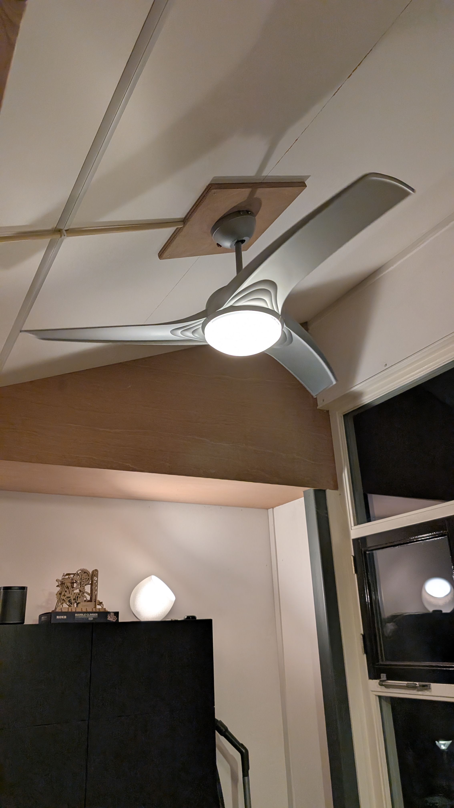
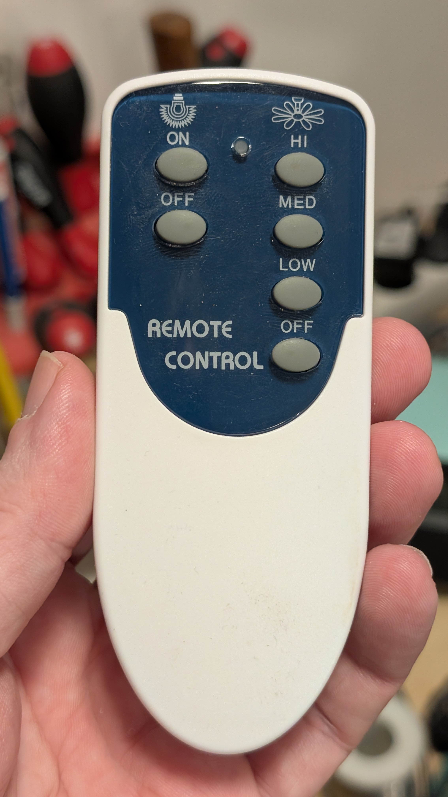
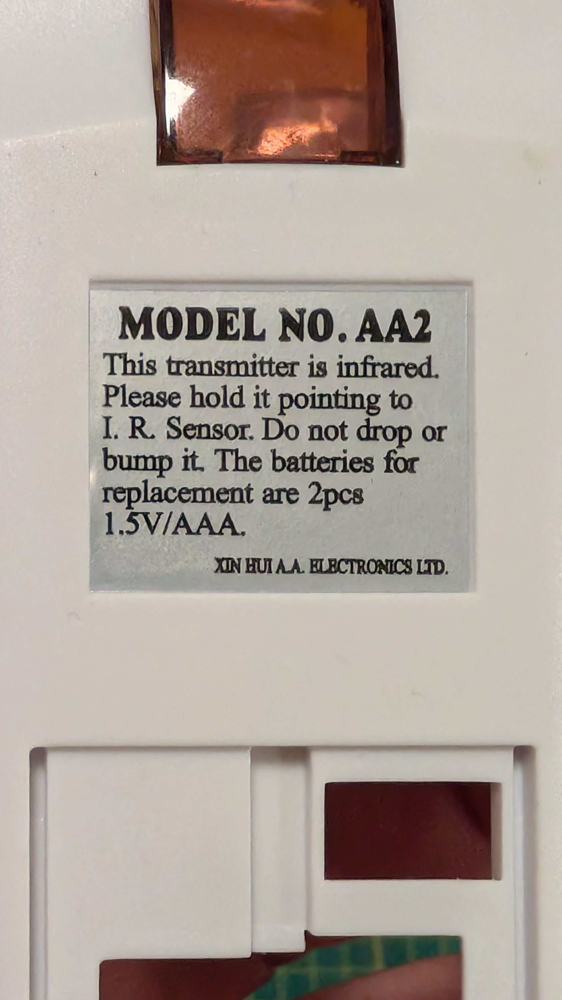
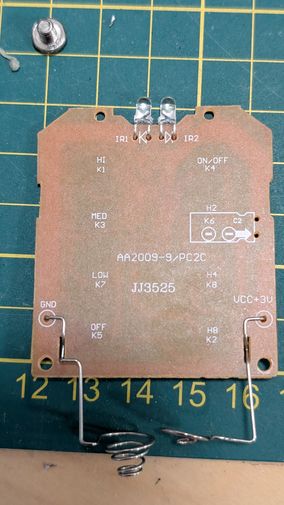
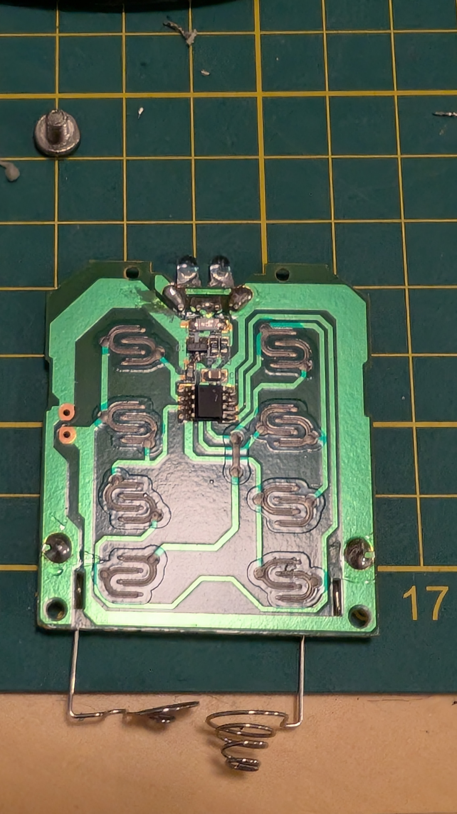

# Ceiling fan Emanuel

## Description

My ceilingfan is a "Zilveren plafondventilator Emanuel, met licht" (silver ceiling fan Emanuel, with light) which at the time (2020) was sold by lampen24.nl. This is all I could find back. That product does not seem to be sold anymore.

The remote model is AA2 and the PCB has number AA2009-9/PC2C and JJ3525 printed on it. The buttons seem to be named K1-K8. With the following mapping on the PCB. But note that the light buttons have a different print on the outside. The functionality matches the printing. Also note that only 6 of the 8 available buttons are exposed on the remote rubber button pad.

## Remote

The remote is model AA2, made by "XIN HUI A.A. Electronics LTD"
The PCB is the same as the Madeira. No markings on the IC

## Button mapping

Since the PCB is the same as the Madeira and the buttons actually work as exepcted the following mapping can be derived.

* K1 = HI = Fan high speed
* K3 = MED = Fan medium speed
* K4 = ON = Light On
* K5 = OFF = Fan Off
* K6 = OFF = Light Off
* K7 = LO = Fan low speed

## IR captures

See the log files

## Photos

These are some photos of fan and the remote.

    
