# Madeira

From Hornbach I got the "[MADEIRA Afstandsbediening voor Madeira plafondventilatoren](https://www.hornbach.nl/p/madeira-afstandsbediening-voor-madeira-plafondventilatoren/6139907/)" which is a control unit and remote control and appears to still be sold. The controller has model number AA2009-9EIR on it.

In the end I did not replace the control unit because the remote is working fine with the unit that was in the ceiling fan. Technically this one has "wrong" printing for the light on/off buttons and the 4h and 8h light function does not work. But that is not enough to take the effort to replace the module.

That unit seems to be compatible with a number of their ceiling fan models being:

* Madeira Emvatis Ø 106 cm (HB. art. nr. 6045209)
* Madeira Zapod Ø 122 cm (HB. art. nr. 6045361)
* Madeira Zonda Ø 122 cm (HB. art. nr. 6045362)
* Madeira Forano Ø 76 cm (HB. art. nr. 6045363)
* Madeira Kalif Ø 76 cm (HB. art. nr. 6045365)
* Madeira Bissorte Ø 106 cm (HB. art. nr. 6045391)
* Madeira Ponente Ø 76 cm (HB. art. nr. 6045392)
* Madeira Agestis Ø 132 cm (HB. art. nr. 6045500)
* Madeira Morgien Ø 132 cm (HB. art. nr. 6045501)
* Madeira Kalmen Ø 122 cm (HB. art. nr. 6047665)

## Remote

The remote is model AA3, made by Hornbach (but I assume it is some kind of whitelabel/OEM thing with XIN HUI)

Looking at the PCB in the remote it turns out to be exactly like the Emanuel one. Same numbers AA2009-9/PC2C and JJ3525 and same mapping. The IC also has no markings

## Module

The module is made by Hornbach it says (seems similar to how I remember the Emanuel one)

Model is AA2009-9EIR

The chip in the module is marked with AA2009-9. I could not find a datasheet.

## Button mapping

The following mapping was captured.

* K1 = HI = Fan high speed
* K2 = 8H = Fan 8 hours
* K3 = MED = Fan medium speed
* K4 = ON/OFF = Light On/Off
* K5 = OFF = Fan Off
* K6 = 2H = Fan 2 hours
* K7 = LO = Fan low speed
* K8 = 4H = Fan 4 hours

## IR captures

### HI

```text
0000 006D 0054 0000
0031 0010 0030 0010 0011 0030 0011 002F 0012 002F 0011 0030 0011 0030 0011 0030
0010 0030 0010 0030 0010 0031 0010 011C 0031 0010 0030 0011 0010 0031 0010 0031
0010 0031 0030 0011 0030 0011 0030 0011 0030 0011 0030 0011 0030 0011 0030 00FC
0030 0010 0030 0011 0010 0031 0010 0031 0010 0031 0010 0031 0010 0031 0010 0031
0010 0031 0010 0031 0010 0031 0030 00FC 0030 0010 0030 0011 0010 0031 0010 0031
0010 0031 0010 0031 0010 0031 0010 0031 0010 0031 0010 0032 000F 0031 002F 00FD
002F 0011 002F 0012 000F 0032 000F 0032 000F 0032 000F 0032 000F 0032 000F 0032
000F 0032 000F 0032 000F 0032 002F 00FD 002F 0011 002F 0012 000F 0032 000F 0032
000F 0032 000F 0032 000F 0032 000F 0032 000F 0032 000F 0032 000F 0032 002E 00FD
002F 0011 0030 0011 000F 0032 000F 0032 000F 0032 000F 0032 000F 0032 000F 0032
000F 0032 000F 0032 000F 0032 0030 09D8
```

### MED

```text
0000 006D 0060 0000
0032 0010 0030 0010 0011 0030 0012 002F 0011 0030 0011 0030 0011 0031 0010 0031
0010 0031 0010 0030 0010 0031 0010 011C 0031 0010 0030 0011 0010 0031 0010 0031
0010 0031 0030 0011 0030 0011 0030 0011 0030 0011 0030 0011 0030 0011 0030 00FC
0030 0010 0030 0011 0010 0031 0010 0031 0010 0031 0010 0031 0010 0031 0010 0031
0010 0031 0031 0010 0010 0031 0010 011C 0030 0010 0030 0011 0010 0031 0010 0031
0010 0031 0010 0031 0010 0031 0010 0031 0010 0031 0031 0010 0010 0031 0010 011C
0030 0010 0030 0011 0010 0031 0010 0031 0010 0031 0010 0031 0010 0031 0010 0032
000F 0032 0030 0011 000F 0032 000F 011D 002F 0011 002F 0012 000F 0032 000F 0032
000F 0032 000F 0032 000F 0032 000F 0032 000F 0032 0030 0011 000F 0032 000F 011D
002F 0011 002F 0012 000F 0032 000F 0032 000F 0032 000F 0032 000F 0032 000F 0032
000F 0032 0030 0011 000F 0032 000F 011D 002F 0011 002F 0012 000F 0032 000F 0032
000F 0032 000F 0032 000F 0032 000F 0032 000F 0032 002F 0012 000F 0032 000F 09D8
```

### LOW

```text
0000 006D 0048 0000
0032 0010 002F 0010 0011 0030 0011 0030 0012 002F 0012 002F 0011 0030 0011 0030
0010 0030 0010 0031 0010 0030 0010 011C 0031 0010 0031 0010 0010 0031 0010 0031
0010 0031 0031 0010 0031 0010 0031 0010 0031 0010 0031 0010 0031 0010 0031 00FB
0030 0010 0031 0010 0010 0031 0010 0031 0010 0031 0031 0010 0010 0031 0010 0031
0010 0031 0010 0031 0030 0011 0030 00FC 0030 0010 0030 0011 0010 0031 0010 0031
0010 0031 0030 0011 0010 0031 0010 0031 0010 0031 0010 0031 0030 0011 0030 00FC
0030 0010 0030 0011 0010 0031 0010 0031 0010 0031 0030 0011 0010 0031 0010 0031
0010 0031 0010 0031 0031 0010 0031 00FB 0030 0010 0030 0011 0010 0031 0010 0031
0010 0031 0030 0011 0010 0031 0010 0031 0010 0031 0010 0031 0030 0010 0031 09D8
```

### OFF

```text
0000 006D 0054 0000
0032 000F 0030 000F 0011 0030 0011 002F 0012 002E 0012 002F 0011 0030 0011 0030
0010 0031 0010 0031 0010 0031 0010 011D 0031 0010 0030 0010 0010 0031 0010 0031
0010 0031 0031 0010 0031 0010 0031 0010 0031 0010 0031 0010 0031 0010 0030 00FC
0031 0010 0030 0011 0010 0031 0010 0031 0010 0031 0010 0031 0010 0031 0030 0010
0010 0031 0010 0031 0010 0031 0010 011D 0031 0010 0030 0011 0010 0031 0010 0031
0010 0031 0010 0031 0010 0031 0030 0011 0010 0031 0010 0031 0010 0031 0010 011D
0031 0010 0031 0010 0010 0031 0010 0031 0010 0031 0010 0031 0010 0031 0030 0011
0010 0031 0010 0031 0010 0031 0010 011D 0031 0010 0030 0011 0010 0031 0010 0031
0010 0031 0010 0031 0010 0031 0031 0010 0010 0031 0010 0031 0010 0031 0010 011C
0030 0010 0031 0010 0010 0031 0010 0031 0010 0031 0010 0031 0010 0031 0030 0011
0010 0031 0010 0031 0010 0031 0010 09D8
```

### ON/OFF

```text
0000 006D 0054 0000
0030 0011 0030 000F 0011 0030 0012 002E 0012 002F 0011 0030 0011 0030 0010 0031
0010 0030 0010 0030 0010 0031 0010 0110 0030 0010 0030 0011 0010 0031 0010 0031
0010 0031 0030 0011 0030 0011 0030 0011 0030 0011 0030 0011 0030 0011 0030 00FB
0031 0010 0030 0011 0010 0031 0010 0031 0010 0031 0010 0031 0010 0031 0010 0031
0030 0011 0010 0031 0010 0031 0010 0110 0030 0011 0031 0010 0010 0031 0010 0031
0010 0031 0010 0031 0010 0031 0010 0031 0031 0010 0010 0031 0010 0031 0010 0110
0030 0012 002F 0012 000F 0032 000F 0032 000F 0032 000F 0032 000F 0032 000F 0032
002F 0012 000F 0032 000F 0032 000F 0111 002F 0012 002F 0012 000F 0032 000F 0032
000F 0032 000F 0032 000F 0032 000F 0032 002F 0012 000F 0032 000F 0032 000F 011E
002F 0011 002F 0011 000F 0032 000F 0032 000F 0032 000F 0032 000F 0032 000F 0032
0030 0011 000F 0032 000F 0032 000F 09D8
```

### 2H

```text
0000 006D 0054 0000
0032 000F 0030 0010 0012 002E 0011 002F 0011 0030 0011 0031 0010 0030 0010 0031
0010 0030 0010 0031 0010 0031 0010 0110 0030 0010 0030 0011 0010 0031 0010 0031
0010 0031 0030 0011 0030 0011 0030 0011 0030 0011 0030 0011 0030 0011 0030 00FB
0031 0010 0030 0011 0010 0031 0010 0031 0010 0031 0010 0031 0030 0011 0010 0031
0010 0031 0010 0031 0010 0031 0010 0110 0030 0010 0031 0010 0010 0031 0010 0031
0010 0031 0010 0031 0030 0011 0010 0031 0010 0031 0010 0031 0010 0031 0010 0110
0030 0011 0030 0011 0010 0031 0010 0031 0010 0031 0010 0031 0031 0010 0010 0031
0010 0031 0010 0031 0010 0031 0010 0110 0030 0011 0030 0011 0010 0031 0010 0031
0010 0031 0010 0031 0030 0011 0010 0031 0010 0031 0010 0031 0010 0031 0010 011D
0030 0010 0031 0010 0010 0031 0010 0031 0010 0031 000F 0032 002F 0011 0010 0031
0010 0032 000F 0032 000F 0032 000F 09D8
```

### 4H

```text
0000 006D 003C 0000
0032 000F 002F 0010 0011 0030 0011 002F 0012 002F 0012 002F 0011 0030 0010 0031
0010 0030 0010 0030 0010 0031 0010 011D 0031 0010 0030 0011 0010 0031 0010 0031
0010 0031 0030 0011 0030 0011 0030 0011 0030 0011 0030 0011 0030 0011 0030 00FD
0031 0010 0030 0011 0010 0031 0010 0031 0010 0031 0030 0011 0010 0031 0010 0031
0010 0031 0030 0011 0030 0011 0010 011D 0031 0010 0030 0011 0010 0031 0010 0031
0010 0031 0030 0011 0010 0031 0010 0031 0010 0031 0030 0011 0030 0011 0010 011C
0030 0010 0030 0011 0010 0031 0010 0031 0010 0031 0030 0011 0010 0031 0010 0031
0010 0031 0030 0011 0030 0011 0010 09D8
```

### 8H

```text
0000 006D 003C 0000
0031 0010 0030 000F 0011 002F 0011 002F 0012 002E 0011 002F 0011 002F 0011 0030
0010 0031 0010 0030 0010 0030 0010 011D 0031 0010 0031 0010 0010 0031 0010 0031
0010 0031 0031 0010 0031 0010 0031 0010 0031 0010 0031 0010 0031 0010 0031 00FC
0031 0010 0030 0011 0010 0031 0010 0031 0010 0031 0010 0031 0010 0031 0010 0031
0010 0031 0010 0031 0031 0010 0010 011D 0031 0010 0030 0011 0010 0031 0010 0031
0010 0031 0010 0031 0010 0031 0010 0031 0010 0031 0010 0031 0030 0011 0010 011C
0030 0010 0030 0011 0010 0031 0010 0031 0010 0031 0010 0031 0010 0031 0010 0031
0010 0031 0010 0031 0031 0010 0010 09D8
```

## Photos

Photos of the Madeira module and remote

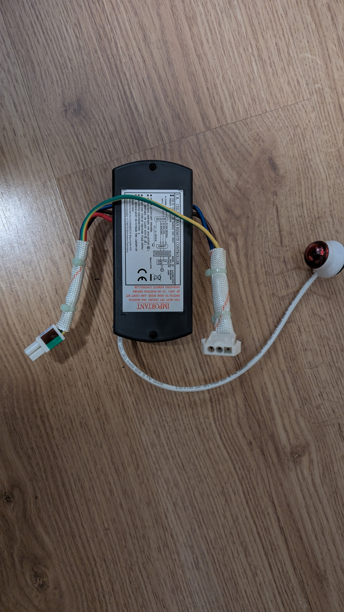 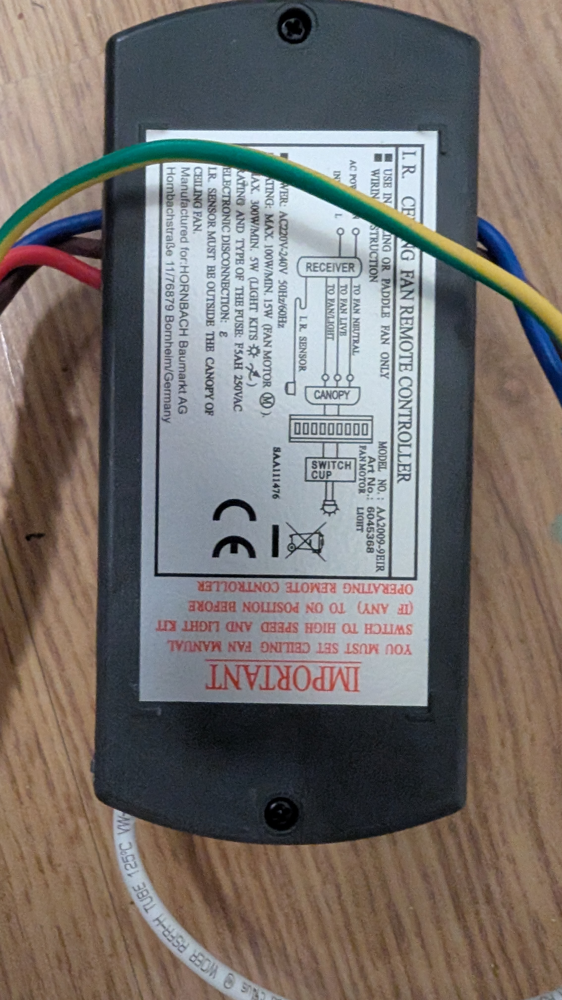 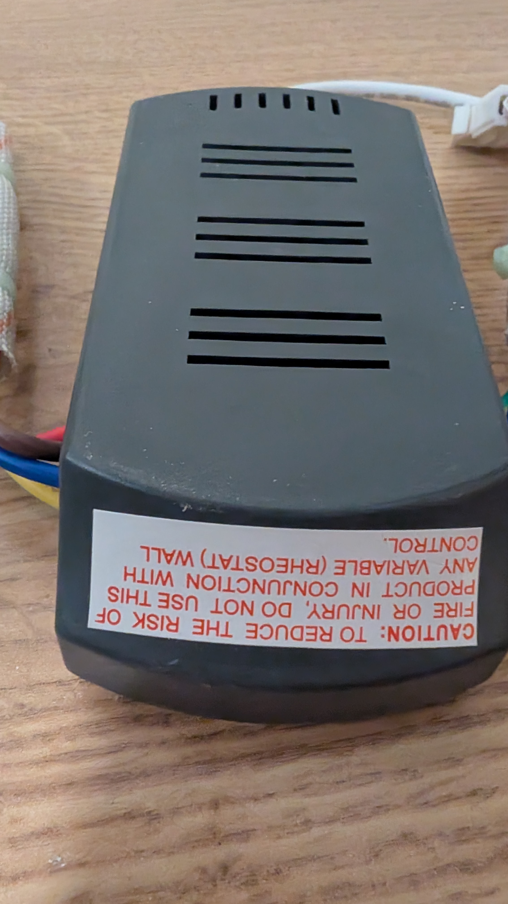 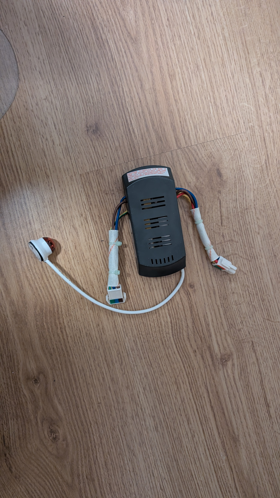 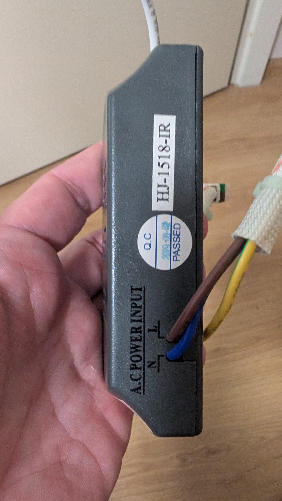 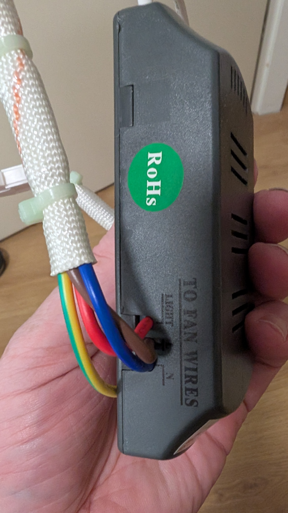 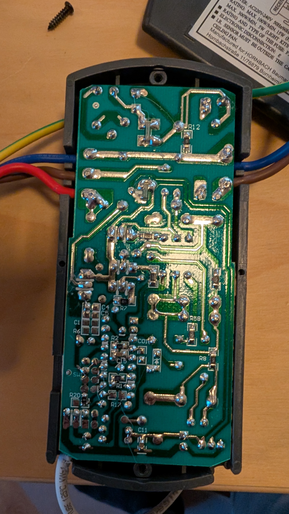 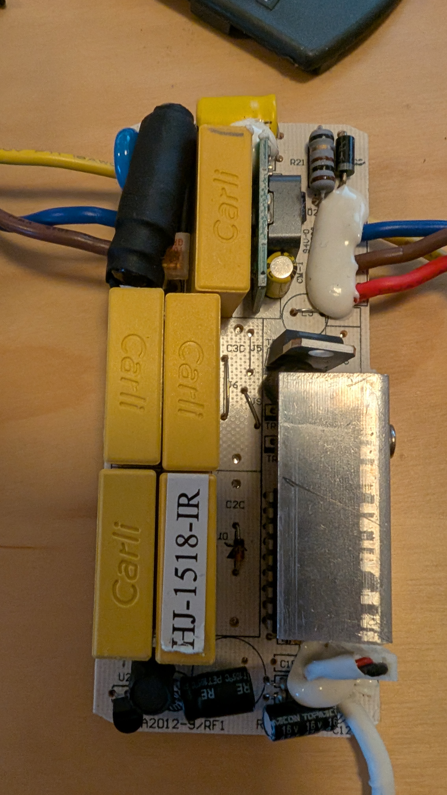 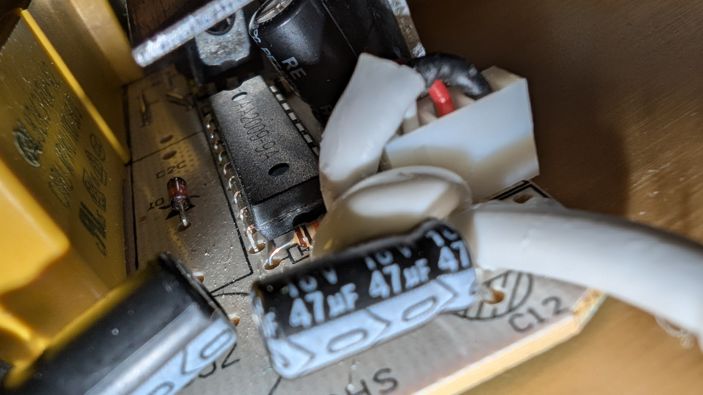 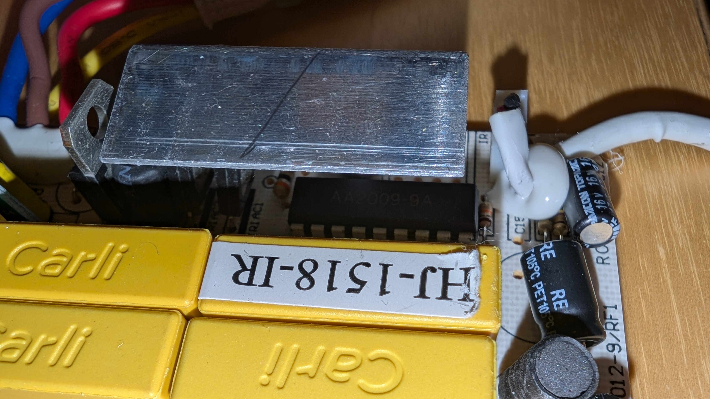

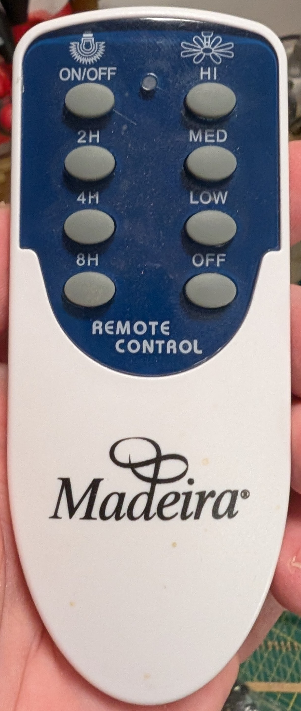 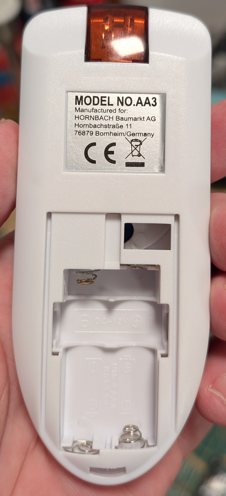 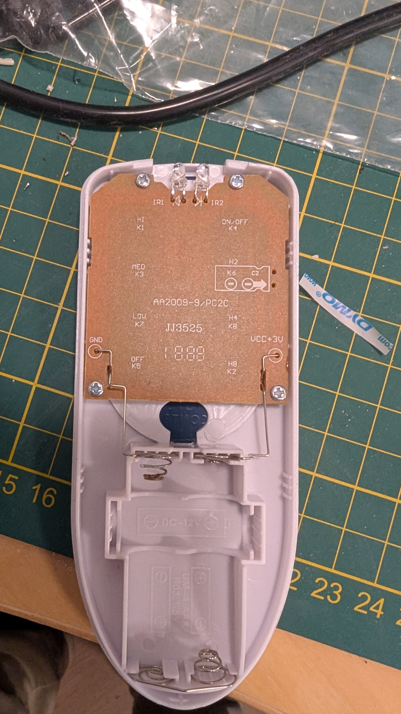 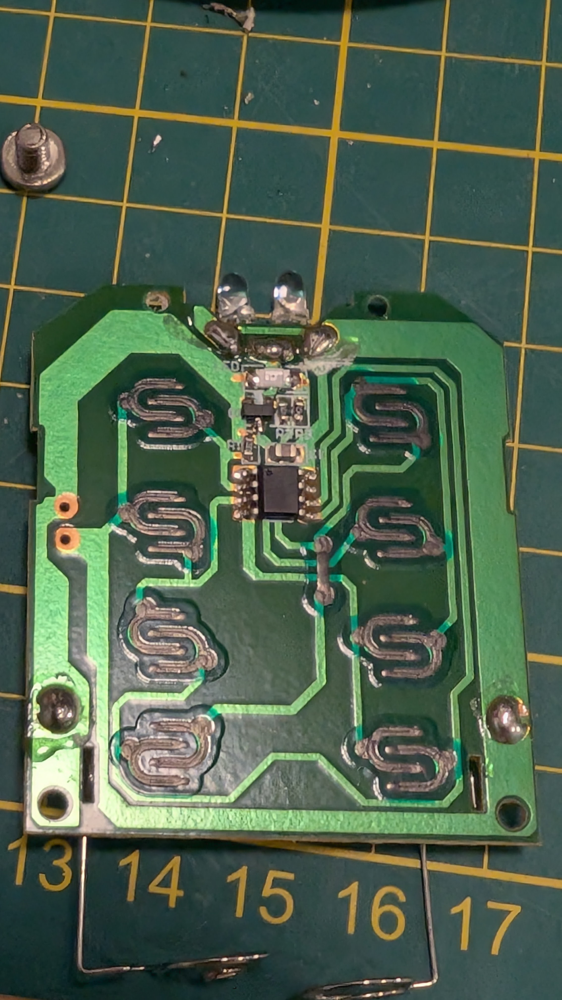
